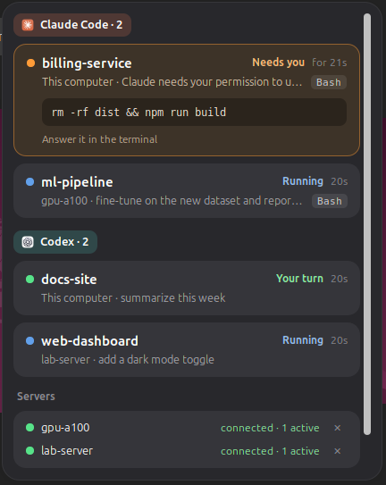

<div align="center">

# 🐧 Agentail

**The AI coding agent status island for Linux.**

Claude Code and Codex — on your desktop and on every SSH server — in the GNOME top bar,
with your subscription limits one click away.

[](https://github.com/YeTianwei/Agentail/releases)
[](LICENSE)




</div>

## 💡 What is Agentail?

You start Claude Code in one terminal, Codex in another, and two more on the GPU server. Then you
switch to something else, and the agent that has been waiting ten minutes for your permission is
the one you never look at.

Most tools that watch coding agents live in the macOS notch. **Agentail is made for the Linux
desktop**, and for the servers you SSH into, where the long runs actually happen. A small capsule
in the GNOME top bar shows what every agent is doing; it turns orange and names the project when
one of them needs you. Click it for a card per session: which machine, which project, what it is
doing, and for a permission prompt, the exact command it wants to run.

Agentail only watches. You still answer agents in their own terminal.

## ✨ Highlights

- 🐧 **Linux first.** A native GNOME Shell extension and a `.deb`, not a port of a Mac app.
- 🌐 **Your servers are first class.** Sessions on remote machines reach your desktop through an
  `ssh -R` tunnel. Add a server from the panel in two clicks; nothing runs on it but one small
  hook script.
- 📦 **Install and forget.** `apt install`, log in again, done. The hooks, the daemon and the panel
  set themselves up.
- 🛡️ **Never in the agent's way.** The hook sends one message and exits. If your desktop is not
  listening it returns at once, prints nothing, and never blocks or fails a tool call.
- 📊 **Usage limits at a glance.** Claude Code's 5-hour and weekly limits and Codex's, with when
  each one resets, without reading your login files.
- 🔒 **Local and private.** Your machines talk to your desktop over SSH and Unix sockets. No
  account, no cloud, no telemetry.
- 🌗 **Light and dark.** One click, top right of the panel.
- 🆓 **Open source.** MIT licensed, written from scratch.

## 👀 At a glance

| The capsule shows | Meaning |
|---|---|
| ⚪ a small dot | nothing is running |
| 🔵 agent logos + a spinner and a number | that many sessions are working |
| 🟢 a green dot and a number | that many sessions are waiting for your next prompt |
| 🟠 orange, "*project* needs you" | an agent is asking for permission |
| 🔴 a red dot in the corner | a server is unreachable |

You also get a desktop notification when a turn finishes or an agent asks for permission.

## 📊 Usage limits

The panel's **Usage** section shows how much of your subscription is left: one card per agent, a
bar per window (5 hours, week), the percentage and when it resets. The bar turns orange from 70 %
and red from 90 %.

| Agent | Where the numbers come from | When they refresh |
|---|---|---|
| Claude Code (Pro / Max) | the input Claude Code gives its status line | whenever Claude answers, here or on a server |
| Codex | Codex itself (`codex app-server`), else its session files | when you open the panel (at most once a minute) |

To read Claude's numbers, Agentail wraps your status line command: it still gets the same input and
prints the same output, and uninstalling puts it back. Agentail never reads `~/.claude/.credentials.json`
or `~/.codex/auth.json`. A card that has not been updated for 30 minutes is greyed out; a window
that has reset since shows no old percentage. Usage is per account: if your servers use the same
account as your desktop, one card covers both.

## 🤖 Supported

| Agent | Status | What you see |
|---|---|---|
| Claude Code | ✅ | working, your turn, needs permission (with the command), ended; usage limits on Pro / Max |
| Codex CLI (0.155+) | ✅ | the same, and usage limits; trust the hooks once with `/hooks` |
| Cursor, Gemini CLI, Qwen Code, … | 🗓️ planned | |

| Where | Status |
|---|---|
| Ubuntu 24.04, GNOME 46 (X11 and Wayland) | ✅ tested |
| Other GNOME 45–48 desktops | 👍 should work |
| Other Linux desktops | AppIndicator fallback: `agentail ui` |
| Remote servers | any Linux with Python 3.6+ and key-based SSH |

## 🚀 Quick start

Download `agentail_<version>.deb` from
[Releases](https://github.com/YeTianwei/Agentail/releases), then:

```bash
sudo apt install ./agentail_0.0.2.deb
```

**Log out and back in once** (on X11, Alt+F2, `r`, Enter is enough) and the capsule appears.

Behind the scenes the package started the daemon, which merged the hooks into
`~/.claude/settings.json` and `~/.codex/hooks.json` for the agents you have (backing both up) and
enabled the panel.

> **Codex** only runs hooks you trust: start `codex` once and approve the `agentail-hook` entries
> (or use `/hooks`).

<details>
<summary>🛠️ From source (development)</summary>

```bash
git clone https://github.com/YeTianwei/Agentail && cd Agentail
python3 -m venv --system-site-packages .venv
.venv/bin/pip install -e '.[dev]'
export PATH="$PWD/.venv/bin:$PATH"

agentail install-local              # merge the hooks (add --dry-run to preview)
agentail install-service            # run the daemon with your desktop session
agentail install-gnome-extension    # the panel (--link for a symlink to the source)
```

Build the package with `packaging/build-deb.sh` (output in `dist/`). Do not mix a source install
with the package on one machine: a unit from `install-service` overrides the packaged one.

</details>

## 🌐 Add your servers

1. Open the panel and expand **Servers**.
2. Click **＋ Add server** and pick a host from your `~/.ssh/config` (or type its name).
3. A few seconds later it shows as connected, and its sessions appear next to your local ones.

The server needs key-based login (`ssh <alias> true` works without a prompt) and Python 3.6+.

To remove one, click the **✕** on its row: Agentail puts the server's Claude and Codex settings back
exactly as they were. If the server cannot be reached, **Forget it anyway** just stops watching it.

Prefer the terminal?

```bash
agentail add-host gpu7 --dry-run    # probe the server and show the changes
agentail add-host gpu7
agentail remove-host gpu7
```

Servers that share one NFS home are recognised: the hook is installed once and removed with the
last of them. On each server, run `codex` once to trust its hooks.

## ⚙️ How it works

```
 your server                                   your desktop
┌──────────────────────────┐                  ┌───────────────────────────────────────┐
│ claude / codex           │                  │ agentail daemon (systemd user unit)   │
│   └─ hook: agentail-hook ├─► Unix socket ──►│   one socket per machine              │
│        (one message,     │   via ssh -R     │   → per-agent adapter → session state │
│         never blocks)    │                  │   → ui.sock ──► GNOME Shell extension │
└──────────────────────────┘                  └───────────────────────────────────────┘
       this desktop's agents use the same hook, straight to a local socket
```

- 🪝 **Hook.** `agentail-hook.py` (standard library, Python 3.6+) reads the agent's hook payload
  and sends it, with a whitelist of terminal variables, to a Unix socket. On any problem it exits
  0 silently.
- 🚇 **Tunnel.** One `ssh -N -R` per server. It counts as connected only after an end-to-end ping,
  reconnects with backoff, and marks that server's sessions out of date while it is down.
- 🧠 **Daemon.** Which machine an event came from is decided by the socket it arrived on, never by
  its content. Sessions are kept across restarts.
- 🖥️ **Panel.** A GNOME Shell extension that reads the daemon's `ui.sock`. Payload text (prompts,
  commands, paths) is untrusted: it is shown as plain text and never put into a shell command.

## 🔧 Configuration

Nothing is required. `~/.config/agentail/config.toml` can change:

```toml
[sessions]
stale_after_minutes = 30    # working, then silent: greyed out as "out of date"
forget_after_minutes = 120  # out of date or waiting for you, then silent: removed
ended_minutes = 10          # ended: removed
# Sessions started in (or below) these folders are not shown. Apps like CodexBar start
# `claude` by themselves to read its limits; [] shows everything.
ignore_cwd = ["~/.local/share/CodexBar"]

[setup]
auto = true                 # false: do not set up hooks and the panel automatically
```

A session waiting for permission is never removed on a timer. Restart the daemon after editing:
`systemctl --user restart agentail`.

## 🩺 Troubleshooting

```bash
agentail doctor
```

checks the daemon, autostart, the hooks (and whether Codex trusts them), every server's tunnel and
the panel, and prints the command that fixes each problem.

| Command | What it does |
|---|---|
| `agentail status` | machines, usage limits and sessions in the terminal |
| `agentail tail` | live session changes |
| `journalctl --user -u agentail` | daemon log |
| `agentail setup` | redo the automatic setup by hand |

After an upgrade, the panel tells you if GNOME Shell is still running the old version: press
Alt+F2, `r`, Enter (X11) or log in again.

## 🧹 Uninstall

```bash
agentail remove-host gpu7      # for each server: restores its config files
agentail uninstall-local       # restores ~/.claude/settings.json and ~/.codex/hooks.json
sudo apt remove agentail
```

Run the first two before removing the package, while the `agentail` command is still there.
Hooks left behind are harmless: without the daemon they do nothing.

## 🗺️ Roadmap

- **0.0.3**: more agents (Claude-compatible forks such as Qwen Code, then Gemini CLI and Cursor).
- **Later**: answering permission prompts from the panel.

## 📄 License

MIT. The Claude and OpenAI logos in the extension's `icons/` directory are trademarks of their
owners and are not covered by the MIT license (see `icons/NOTICE.md`).
